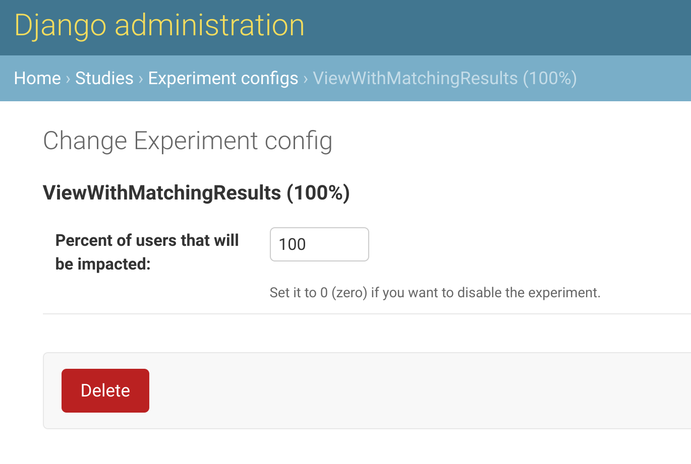

django-studies
==============

.. image:: https://github.com/fitodic/django-studies/actions/workflows/ci.yml/badge.svg?event=push
    :target: https://github.com/fitodic/django-studies/actions
    :alt: Build status

.. image:: https://codecov.io/gh/fitodic/django-studies/branch/master/graph/badge.svg?token=S2WQ9OTR9O
    :target: https://codecov.io/gh/fitodic/django-studies
    :alt: Test coverage status

Have you ever found yourself in a situation where you've made changes to
some functionality, all the tests are passing, manual tests look OK, but
you're still not convinced that you've covered all of the edge-cases?

You know your new implementation is faster or more stable, but you still
have the feeling you're missing something. Wouldn't it be great if you 
could run both implementations side-by-side and compare the results?

Maybe you'd want to try it out on a limited set of users for a certain
period of time just to flesh out all the cases you've missed. Or you
just want to run a couple of experiments and study the effects without
severely impacting the users in a negative way.

Inspired by `GitHub's Scientist
<https://github.com/github/scientist>`_ and
`RealGeeks' lab_tech <https://github.com/RealGeeks/lab_tech>`_, this
project brings
`Joe Alcorn's laboratory <https://github.com/joealcorn/laboratory>`_ to
`Django <https://github.com/django/django>`_'s world not only to allow
you to run experiments, but to dynamically modify their impact on users.
This would give you the confirmations and the peace of mind you're 
looking for *and* your users wouldn't be inconvenienced by potential 
errors.

Installation
^^^^^^^^^^^^

To use this library, install it using ``pip``

.. code:: bash

    pip install django-studies

register the Django app in your ``settings.py``:

.. code:: python

    # project/settings.py
    INSTALLED_APPS = [
        # ...
        "studies",
    ]
    
and run the migrations:

.. code:: bash

    python manage.py studies

Features
^^^^^^^^

* To run an experiment, instantiate the ``Experiment`` class, define the `control` and the `candidate` and `conduct` the experiment. For example, a simple Django class-based view with an experiment would look like (the one from the ``demo`` project):

.. code:: python

    from studies.experiments import Experiment

    class ViewWithMatchingResults(View):
        def get(self, request, *args, **kwargs):
            with Experiment(
                name="ViewWithMatchingResults",
                context={"context_key": "context_value"},
                percent_enabled=100,
            ) as experiment:
                arg = "match"
                kwargs = {"extra": "value"}
                experiment.control(
                    self._get_control,
                    context={"strategy": "control"},
                    args=[arg],
                    kwargs=kwargs,
                )
                experiment.candidate(
                    self._get_candidate,
                    context={"strategy": "candidate"},
                    args=[arg],
                    kwargs=kwargs,
                )
                data = experiment.conduct()

            return JsonResponse(data)

        def _get_control(self, result, **kwargs):
            return {"result": result, **kwargs}

        def _get_candidate(self, result, **kwargs):
            return {"result": result, **kwargs}

* Adjust the percentage of users who'll be impacted by this experiment via the admin:

* To add support for your own reporting system, whether it's ``logging``, ``statsd`` or something else, override the ``Experiment`` class' ``publish`` method and make the call (another example from the ``demo`` project):

.. code:: python

    import logging
    from studies.experiments import Experiment

    logger = logging.getLogger()

    class ExperimentWithLogging(Experiment):
    """
    An override that provides logging support for demonstration
    purposes.
    """

    def publish(self, result):
        if result.match:
            logging.info(
                "Experiment %(name)s is a match",
                {"name": result.experiment.name},
            )
        else:
            control_observation = result.control
            candidate_observation = result.candidates[0]
            logging.info(
                json.dumps(
                    control_observation.__dict__,
                    cls=ExceptionalJSONEncoder,  # defined in `demo.overrides`
                )
            )
            logging.info(
                json.dumps(
                    candidate_observation.__dict__,
                    cls=ExceptionalJSONEncoder,
                )
            )
            logging.error(
                "Experiment %(name)s is not a match",
                {"name": result.experiment.name},
            )

* Override any method from ``laboratory``'s ``Experiment`` class, including `how you make the comparison <https://github.com/joealcorn/laboratory#controlling-comparison>`_:

.. code:: python

    from studies.experiments import Experiment

    class MyExperiment(Experiment):
        def compare(self, control, candidate):
            return control.value['id'] == candidate.value['id']

Caveats
^^^^^^^

As always there are certain caveats that you should keep in mind. As
stated in ``laboratory``'s
`Caveats <https://github.com/joealcorn/laboratory#caveats>`_, if the
control or the candidate has a side-effect like a write operation to the
database or the cache, you could end up with erroneous data or similar
bugs.

At the moment, this library doesn't provide a safe write mechanism to
mitigate this situation, but it may in the future.

Contributing
^^^^^^^^^^^^

To contribute to this project, take a look at `CONTRIBUTING.rst <./CONTRIBUTING.rst>`_.
